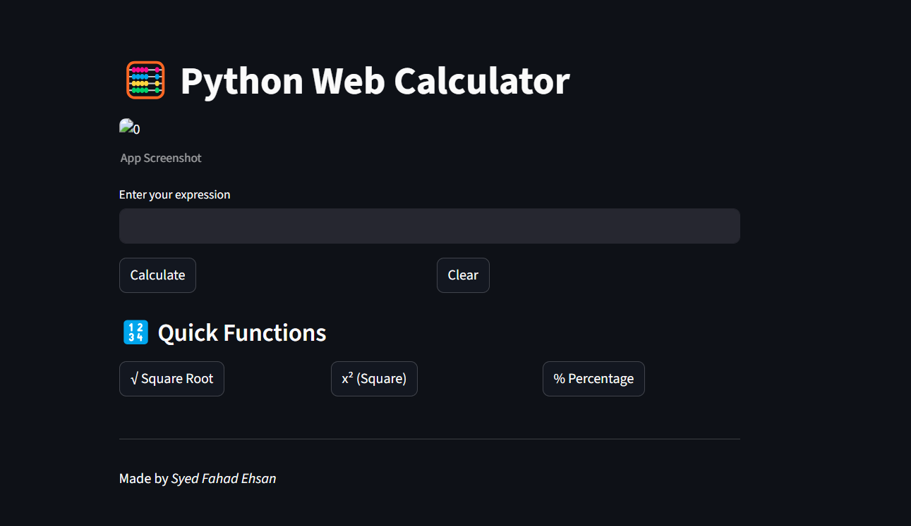

# Streamlit-calculator
A beginner-friendly calculator web app built using Python and Streamlit.
This project was created to practice web app development and GUI logic using Python.

 
You can add your own screenshot here.

---

## 🚀 Try the App

🚀 [Try the Calculator Live](https://app-calculator-cxybzjkjer7twxo8hyptqo.streamlit.app)

---

## 💡 Features

- Web-based calculator using Streamlit
- Handles arithmetic expressions
- Supports:
  - Square root (√)
  - Square (x²)
  - Percentage (%)
- Clean layout using Streamlit columns
- Input via text box (keyboard support)

---

## 🛠️ Technologies Used

- Python 3.10+
- Streamlit

---

## 🔧 How to Run Locally

```bash
# Install Streamlit
pip install streamlit

# Run the app
streamlit run streamlit_calculator.py
